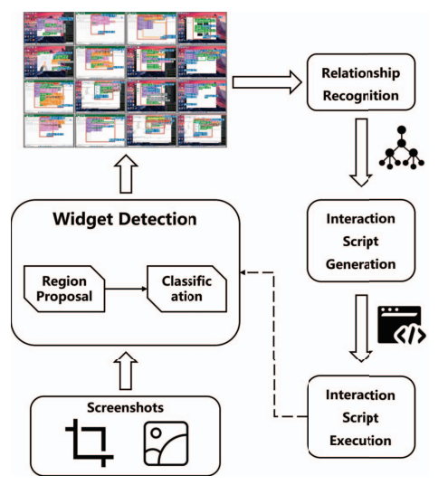

## Aim
Nowadays, AI is getting smarter and smarter, everyday. It has also gained a good enough thinking and reasoning abilities. However, Even if any task doesn't really require any complicated thinking/reasoning it can still not execute the tasks for you.

For ex,
1. Buy Surf for me on amazon.com
1. or find my timetable in my emails and tell me my tomorrow's schedule.

Our aim is to give ai models the capability of controlling desktop applications and executing tasks for us.
However, for this project, we will be focusing on browser based tasks only.

## What is this project?
We want to develop a software which can use the thinking and reasoning ability of AI models to allow them to execute opearations on behalf of the user.

## How will it help people?
#### For Individuals
1. Automated Online Shopping
2. Bill Payments & Form Filling
3. Scheduling & Email Management

#### For Students
1. Research Assistance
2. Automated Course Registration
3. Scholarship & Job Applications

#### For Developers
1. **Automating Repetitive DevOps Tasks**: Filling out online deployment forms, setting up CI/CD configurations, and managing cloud services.
2. **Code & API Documentation Search**: AI can fetch relevant documentation or Stack Overflow answers.
3. **Bug Report Filing**: The AI can automatically collect logs and submit structured bug reports to tracking systems.

#### For Teachers & Academics
1. **Automated Paper Grading**: It can assist in reviewing and grading assignments based on predefined criteria.
1. **Course Management**: Automating the process of uploading assignments, managing student progress, and sending notifications.
1. **Content Curation**: Finding relevant research papers and compiling notes for lectures.

## What would be our scope for this project?
Our scope for this project is to develop a software which can 
1. Perform all sorts of browser based tasks, for ex,
1. Read my CV & find jobs appropriate for me and then start applying for them.
1. Easily perform tasks which do not require any complex reasoning or thinking for example, filling out forms for you.

## Impact
1. **Productivity Boost**: Reduces time spent on repetitive tasks, allowing people to focus on more meaningful work.
1. **Accessibility**: Can help people with disabilities by automating tasks that require precise manual input.
1. **Personal AI Assistants**: Paves the way for personalized digital assistants that can perform real actions, not just answer questions.
1. **Future Potential**: If extended beyond browsers, it could lead to AI-driven automation across all software applications, transforming how people interact with technology.

## How?

[Draw.io](https://app.diagrams.net/#G1MJhnos0fNUarfe69f8H58qv1kpj5sGZb#%7B%22pageId%22%3A%22Ar7Q7IABHMq8kOB4KptJ%22%7D) 

## Dataset?

## What is included in our future plans?
1. Let this software run in the background, so you need not keep a browser window open all the time.
1. Remember and learn from the tasks you perform, so it can better help you in your future tasks.
1. Let this software run on a server/multiple devices, so you can control your desktop from your phone.
1. It can remind you of any deadlines you have.